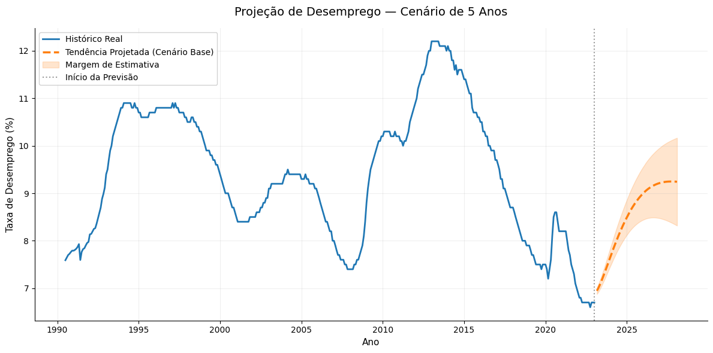

# 📉 Previsão de Desemprego Juvenil na Zona do Euro com LSTM


> *"Dados só têm valor quando as pessoas conseguem entendê-los."*
>
> Uma análise preditiva utilizando Deep Learning para transformar dados históricos em inteligência estratégica e modelar tendências econômicas.

---

## 📋 Sobre o Projeto

Este projeto aplica redes neurais recorrentes do tipo **LSTM (Long Short-Term Memory)** para prever a taxa de desemprego na Zona do Euro. O diferencial desta abordagem é a capacidade de **capturar ciclos econômicos de longo prazo**, permitindo simular cenários futuros com maior embasamento do que modelos lineares tradicionais.

A análise utiliza uma série temporal histórica real (1990-2023), extraída da base de dados do Federal Reserve (FRED), focando em apoiar tomadas de decisão através da identificação de tendências estruturais.

## 🛠️ Tecnologias Utilizadas

* **Linguagem:** Python
* **Modelagem:** TensorFlow / Keras (Stacked LSTM)
* **Manipulação de Dados:** Pandas, NumPy
* **Visualização:** Matplotlib (com foco em Storytelling)
* **Pré-processamento:** Scikit-Learn (MinMaxScaler)
* **Reprodutibilidade:** `requirements.txt`

## 📊 Metodologia e Evolução do Modelo

O projeto seguiu um pipeline rigoroso de Data Science, com melhorias incrementais na arquitetura da rede:

1.  **Coleta de Dados:** Extração da série histórica `HIGN00EA19M052N` (Harmonized Unemployment Rate).
2.  **Pré-processamento:** Normalização (escala 0-1) para estabilidade numérica.
3.  **Engenharia de Features (Windowing):**
    * *Ajuste Estratégico:* Utilizamos uma janela de observação (*Look-back*) de **60 meses (5 anos)**. Isso permite que a rede aprenda ciclos econômicos completos (crises e recuperações) em vez de focar apenas no curto prazo.
4.  **Arquitetura da Rede (Stacked LSTM):**
    * Implementação de múltiplas camadas LSTM para capturar padrões complexos.
    * Aplicação de camadas de **Dropout** para evitar *overfitting* e garantir que o modelo generalize bem para dados não vistos.

## 🚀 Resultados e Simulação de Cenários

O modelo demonstrou alta capacidade de generalização, conseguindo identificar pontos de inflexão importantes na economia (como a recuperação pós-crises).

### 🔮 Previsão Futura (5 Anos à Frente)

Um dos principais entregáveis deste projeto é a simulação de longo prazo (*Multi-step Forecasting*). Diferente de previsões pontuais, geramos um **Cenário de Tendência**:

* **Linha de Tendência:** Projeção do comportamento estrutural do desemprego.
* **Margem de Incerteza (Sombra):** Adicionamos visualmente uma faixa de estimativa que cresce ao longo do tempo, comunicando de forma transparente que a volatilidade aumenta no longo prazo.

Isso transforma o gráfico de uma simples "previsão matemática" em uma ferramenta de **Gestão de Risco**.


*(Exemplo visual da projeção de 5 anos com margem de incerteza)*

## 📦 Como Executar o Projeto

Para garantir que o projeto rode na sua máquina exatamente como rodou na nossa, incluímos um arquivo de dependências.

1.  Clone o repositório:
    ```bash
    git clone [https://github.com/seu-usuario/seu-repositorio.git](https://github.com/seu-usuario/seu-repositorio.git)
    ```
2.  Instale as bibliotecas necessárias:
    ```bash
    pip install -r requirements.txt
    ```
3.  Execute os notebooks na pasta `/notebooks`.

## 📂 Estrutura do Repositório

* `/data`: Arquivos CSV brutos e processados.
* `/notebooks`: Código fonte documentado e exploratório.
* `/images`: Gráficos gerados para os relatórios.
* `/presentation`: Material de apoio visual.

## 👨‍💻 Autores

* **Gabriel Lopes Cavallari** - *Análise de Dados, Visualização e Documentação*
* **Derek Amaral** - *Implementação do Modelo LSTM e Pesquisa*
* **Luiz Alberto Lucchetta** - *Visualização e Apresentação*

---
*Este projeto foi desenvolvido como parte da disciplina de Inteligência Artificial do IFSP.*
